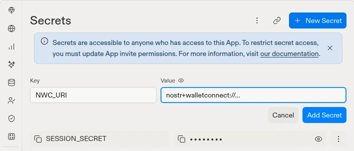
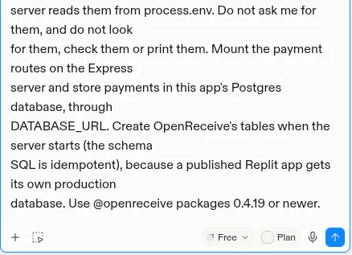
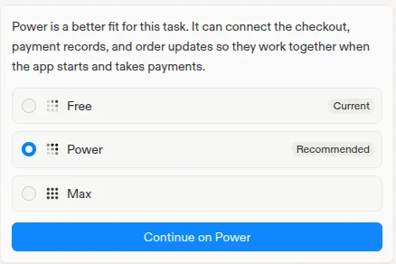
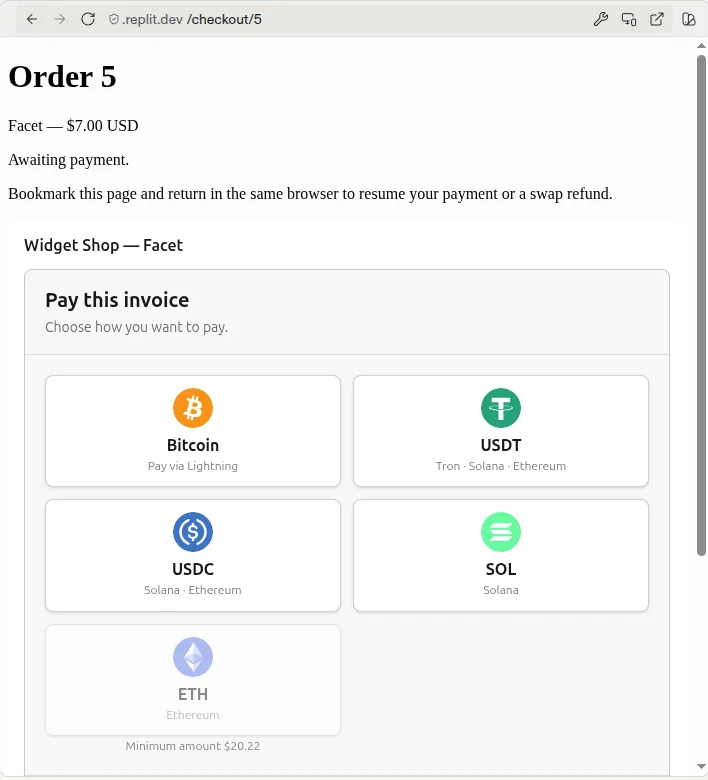
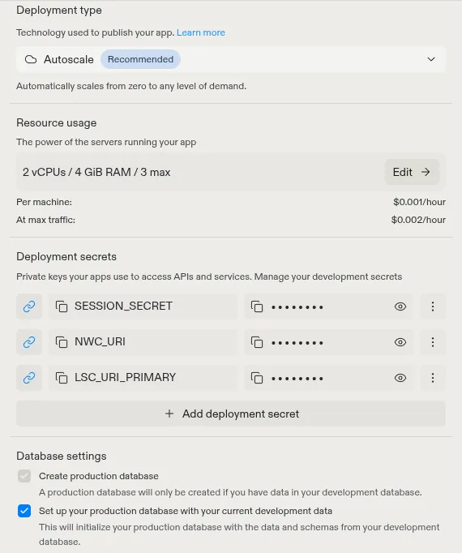
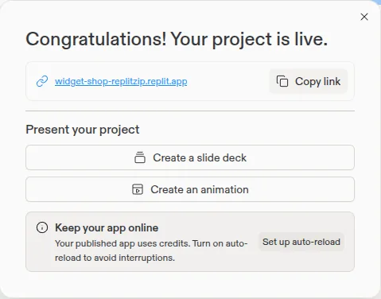

# Bitcoin checkout on Replit

Replit Agent builds web apps with an Express server and a Postgres database,
and OpenReceive's Express package runs in them as is. Your app's own server
code creates each Lightning invoice, the payment goes straight to your
wallet, and payment attempts are stored in your app's Postgres database.
There is no OpenReceive account, no API key and no background worker.

Optional swaps let customers pay with **USDT, USDC, SOL, and ETH**. A swap
provider you configure converts the payment to **BTC over Lightning**, and it
settles into the same wallet. Available assets and networks depend on the
provider.

Use `@openreceive/*` 0.4.19 or newer.

## Before you start

- A receive-only NWC code from your Lightning wallet
  ([get one](https://openreceive.org/get_a_nwc_code_to_receive_payments)).
  It can create invoices and read payments, but it cannot spend.
- Optional: a swap provider code, for USDT, USDC, SOL and ETH
  ([set one up](https://openreceive.org/set_up_swap_provider)).

Put both in the app's Secrets, never in the chat. Secrets reach your server
code as environment variables, and Replit links them to the published app.

## Add checkout to your Replit app

1. Open **Tools** → **Secrets** → **New Secret**. Add `NWC_URI` with your
   wallet code, then `LSC_URI_PRIMARY` with your swap provider code. Replit
   already gives every app a Postgres database in `DATABASE_URL`.

   

2. Send Replit Agent this prompt:

<!-- platform-prompt:begin -->
```text
Add Bitcoin Lightning checkout to this app with OpenReceive. Download the
directions with your terminal and follow them exactly:

curl -fsSL https://openreceive.org/agent-directions/node/full.md

NWC_URI and LSC_URI_PRIMARY are already set as this app's Secrets, and the
server reads them from process.env. Do not ask me for them, and do not look
for them, check them or print them. Mount the payment routes on the Express
server and store payments in this app's Postgres database, through
DATABASE_URL. Create OpenReceive's tables when the server starts (the schema
SQL is idempotent), because a published Replit app gets its own production
database. Use @openreceive packages 0.4.19 or newer.
```
<!-- platform-prompt:end -->

   

3. If Agent offers to switch from **Free** to **Power**, choose **Continue on
   Power**. In Free mode Agent stops partway through this setup. On Power it
   took about 11 minutes in our test.

   

The directions tell Agent how to map the three hooks onto your existing
orders and how to render the checkout. Agent ends with "Setup is finished"
and a link to try the checkout.

This prompt is for apps with a Node server, which is what Replit Agent builds
by default. If your app's server is Python, follow the
[FastAPI](quickstart-fastapi.md) or [Django](quickstart-django.md) quickstart
instead.

## Check it

In Preview, place an order. Its checkout shows the payment methods. Pick
Bitcoin to see a Lightning invoice in sats. If the app stops at start, read
the Console: usually `NWC_URI` is missing from Secrets, or the code is not
receive-only.



Pay a small order from your wallet to see it settle: the checkout shows the
payment as received, and `onPaid` marks the order paid.

## Publish

1. Select **Publish**. Under **Advanced settings**, keep **Autoscale**, and
   check that **Deployment secrets** lists `NWC_URI` (and `LSC_URI_PRIMARY`)
   with a link icon: Replit copies your Secrets into the published app. If you
   add a secret after publishing, check this list and republish.

   

2. Select **Publish** and wait for "Your project is live", about four
   minutes.

   

3. Open the `replit.app` address, place an order and pick Bitcoin. A
   Lightning invoice appears.

   

The published app uses its own production database, separate from the one
you build with. Replit can start it with a copy of your development data,
and the server also creates OpenReceive's tables there on its first start.

## Start from the starter

The [Express + Postgres starter](https://github.com/OpenReceive/openreceive/tree/master/examples/express-postgres-starter)
is a one-product shop with checkout already wired, set up for Replit
Autoscale. Its `replit.md` tells Agent how the payment code fits together, so
you can ask for products, pages and design and keep checkout working. The
README shows how to copy it into a repository of your own and import it into
Replit.

## How it runs on Replit

- **No worker or cron job.** Each request to the payment routes also checks
  the wallet for settled invoices, through a lock in your database. A payer
  who closes the tab is settled on the next request, so Autoscale can scale
  to zero between visits.
- **Reserved VM, optionally.** A Reserved VM never sleeps, so it can also run
  the optional notifications worker, which settles a payment the moment the
  wallet reports it. Autoscale does not need it.
- **Direct database connection.** `DATABASE_URL` points at Postgres 16 with
  no pooler, so `pg` and the usual ORMs work unchanged. Do not force TLS in
  code: the development database does not use it and the production database
  requires it, and each one's URL already says which.
- **Port and health check.** The server listens on `0.0.0.0`. When you
  publish, Replit requests the home page and fails the publish if it takes
  more than 5 seconds, so keep slow work off `/`.
- **Rate limiting.** Keep `rateLimiting: true` with
  `app.set("trust proxy", 1)`. Replit's proxy sets `x-forwarded-for`, so the
  limit applies per payer.
- **Keep order pages reachable.** A payer with a swap in progress comes back
  through the order's own page to claim a refund. See
  [swap refunds](swap-refunds.md).

More detail: [Express quickstart](quickstart-node.md),
[Payment storage](storage.md), [Security](security.md).
