# Bitcoin checkout on Vercel and v0

v0 builds Next.js apps that run on Vercel, and OpenReceive's Next.js package
runs in them as is. Your app's own server code creates each Lightning invoice,
the payment goes straight to your wallet, and payment attempts are stored in
your app's Postgres database. There is no OpenReceive account, no API key and
no background worker.

Optional swaps let customers pay with **USDT, USDC, SOL, and ETH**. A swap
provider you configure converts the payment to **BTC over Lightning**, and it
settles into the same wallet. Available assets and networks depend on the
provider.

Use `@openreceive/*` 0.4.19 or newer. Earlier versions cannot reach the wallet
from a Next.js 16 production build.

## Before you start

- A receive-only NWC code from your Lightning wallet
  ([get one](https://openreceive.org/get_a_nwc_code_to_receive_payments)).
  It can create invoices and read payments, but it cannot spend.
- Optional: a swap provider code, for USDT, USDC, SOL and ETH
  ([set one up](https://openreceive.org/set_up_swap_provider)).

Put both in the project's environment variables in Vercel, never in the
chat. Give each one all three environments, **Production**, **Preview** and
**Development**: the v0 preview only sees Development variables, so a code
set only for Production leaves the preview's checkout unavailable.

## Start from the starter

The [Next.js + Postgres starter](https://github.com/OpenReceive/openreceive/tree/master/examples/next-postgres-starter)
is a one-product shop with checkout already wired.

1. Click **Deploy** in its README. Vercel copies the starter into a new GitHub
   repository: pick the **Git Scope** and a name, then **Create**.

   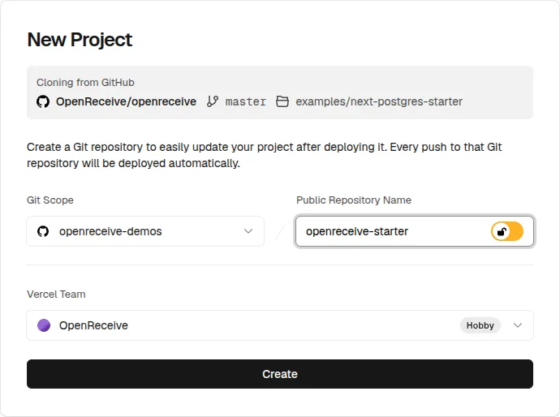

   On the Hobby plan, a repository inside a GitHub organization must be
   public; one under your personal account can stay private. When GitHub asks
   which repositories Vercel may use, install it only where this project
   lives, not on every repository you own.
2. Click **Add** next to Neon, keep the **Free** plan, then **Continue**,
   **Create** and **Done**.

   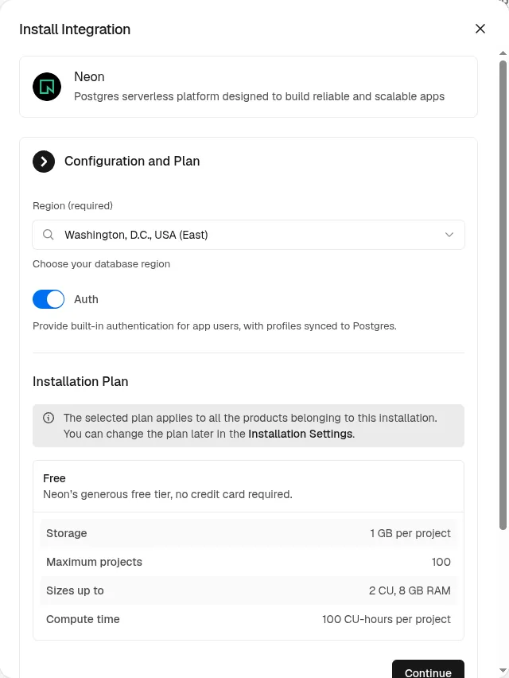

3. Paste your code into `NWC_URI` and click **Deploy**. Vercel sets it for
   Production, Preview and Development, and the first build creates the
   tables.

   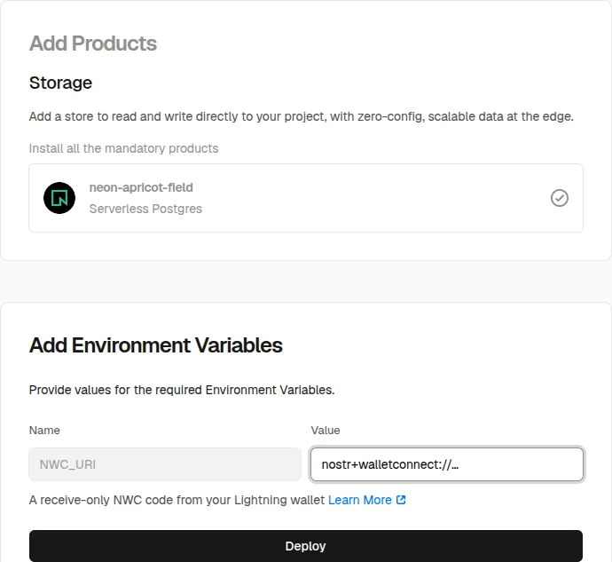

4. In v0, start a new chat, open the **+** menu, choose **Import from…** →
   **Import from GitHub**, and pick the new repository.

   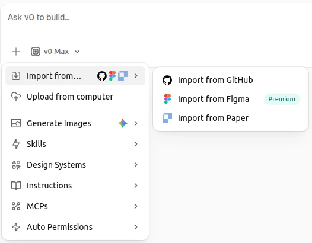

5. v0 sees that the repository already has a Vercel project. Click
   **Continue** to connect the chat to it, so the preview gets the database
   and the environment variables.

   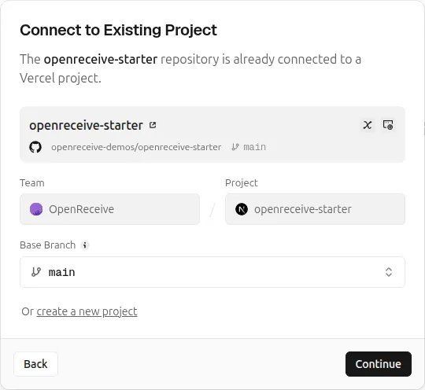

6. Ask v0 for the shop you want: products, pages, design. Keep the payment
   route's three hooks, `authorize`, `amountFor` and `onPaid`, pointed at
   your orders.

   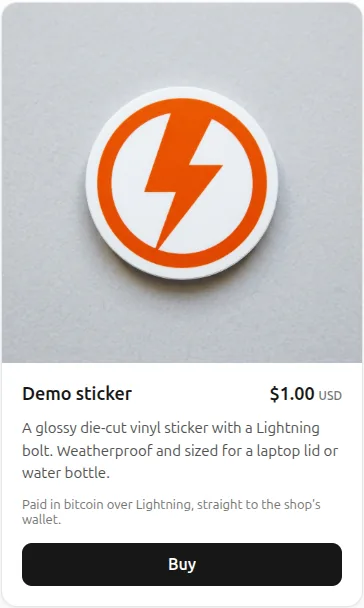

## Add checkout to an existing v0 app

1. Connect a database. When v0 suggests Neon in the chat, click **Install**.
   Otherwise open **Project menu** `...` → **Settings** → **Integrations**
   and add Neon. It adds `DATABASE_URL`, a pooled URL for the app, and
   `DATABASE_URL_UNPOOLED`, a direct URL for creating tables.

   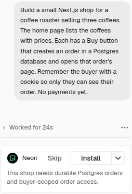

   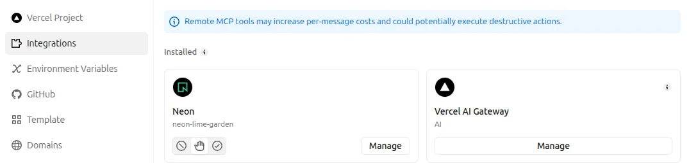

2. Add `NWC_URI` (and `LSC_URI_PRIMARY`) in Vercel. v0's **Settings** →
   **Environment Variables** only lists them: click **Open in Vercel**.

   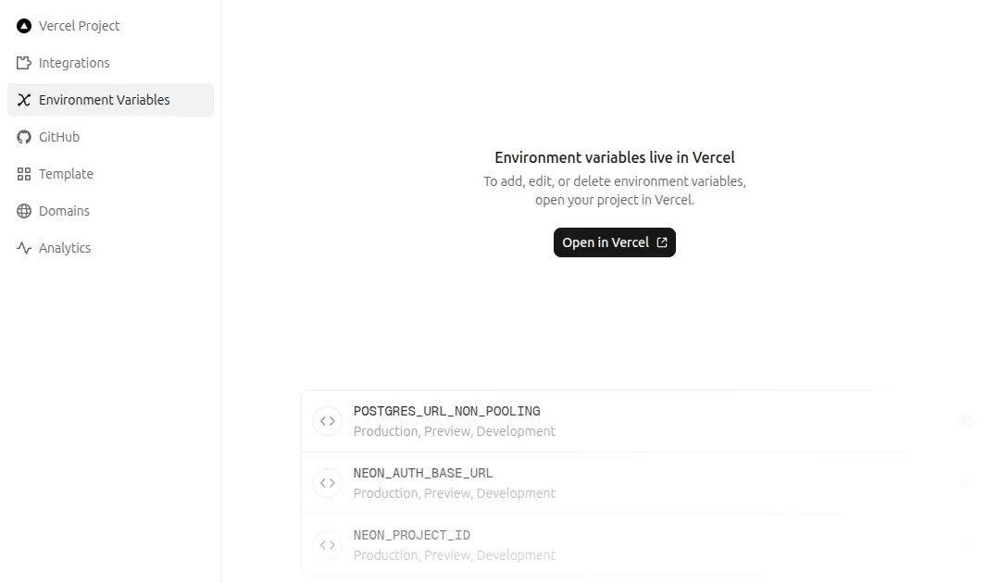

   Then click **Add Environment Variable**, keep the type **Secret**, and
   tick **Production**, **Preview** and **Development**.

   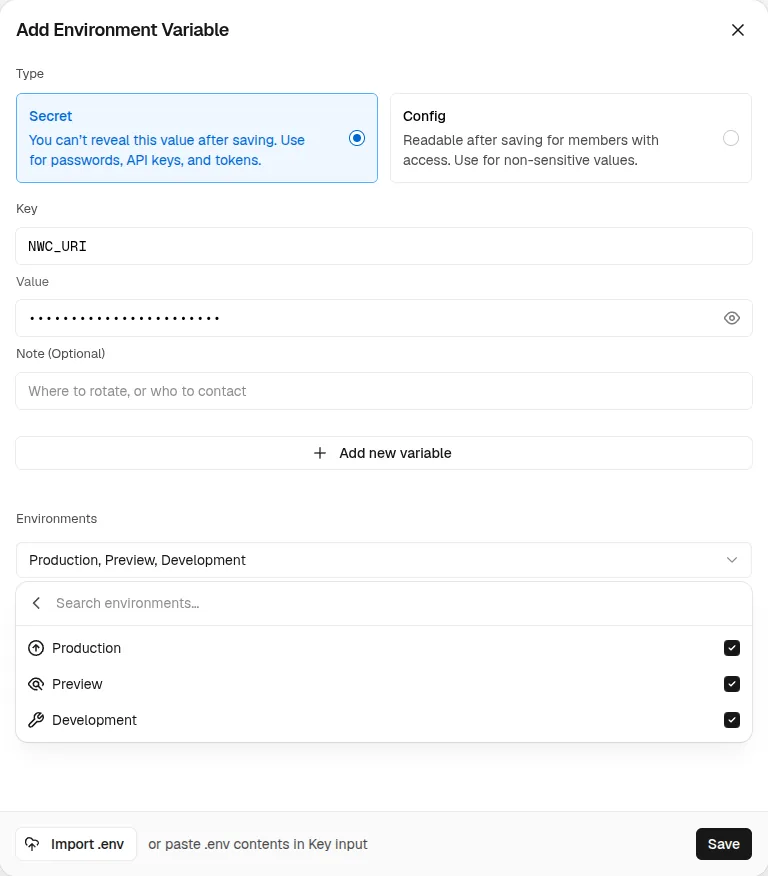

3. Send v0 this prompt:

<!-- platform-prompt:begin -->
```text
Add Bitcoin Lightning checkout to this app with OpenReceive. Download the
directions with your terminal and follow them exactly:

curl -fsSL https://openreceive.org/agent-directions/next/full.md

NWC_URI and LSC_URI_PRIMARY are already set as this project's environment
variables, so do not ask me for them. Store payments in the Neon database:
a pg Pool on DATABASE_URL for the app, and DATABASE_URL_UNPOOLED to create
the tables. Use @openreceive packages 0.4.19 or newer.
```
<!-- platform-prompt:end -->

   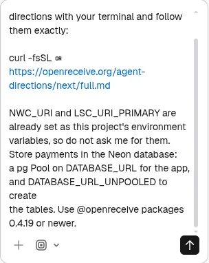

The directions tell v0 how to map the three hooks onto your existing orders
and how to render the checkout. In our test v0 finished in about five
minutes.

## Check it

Open the preview in its own tab with the arrow button in the preview's
address bar. Inside v0's preview pane the browser can drop the shop's
cookie, and the checkout then says "Not authorized".

In the new tab, place an order and open its checkout. You should see the
payment methods and, after you pick Bitcoin, a Lightning invoice in sats.

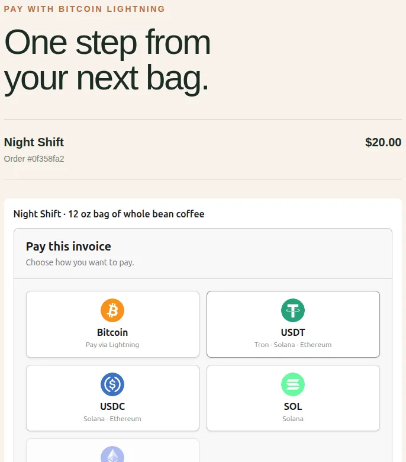

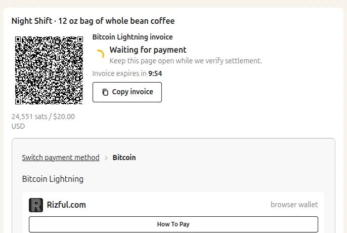

If the checkout says "The payment service is not available", the preview
started before you added `NWC_URI`: restart the preview so it loads the new
variables. Otherwise check the preview's logs: usually the code is missing
from the Development environment, or it is not receive-only.

Pay a small order from your wallet to see it settle: the checkout shows the
payment as received, and `onPaid` marks the order paid.

## How it runs on Vercel

- **No worker or cron job.** Each request to the payment routes also checks
  the wallet for settled invoices, through a lock in your database. A payer
  who closes the tab is settled on the next request. Vercel's once-a-day
  Hobby cron is not needed.
- **Pooled database URL.** Vercel functions reach Neon through its transaction
  pooler. OpenReceive's storage is tested against transaction pooling with
  `pg`, Knex, Prisma (`@prisma/adapter-pg`) and TypeORM.
- **Node runtime.** The payment route runs on Node (`runtime = "nodejs"`),
  never the Edge runtime.
- **Rate limiting.** Keep `rateLimiting: true` with `trustProxyIpHeader: true`.
  Vercel sets `x-forwarded-for`, so the limit applies per payer.
- **Keep order pages reachable.** A payer with a swap in progress comes back
  through `/checkout/<order id>` to claim a refund. See
  [swap refunds](swap-refunds.md).

More detail: [Next.js quickstart](quickstart-next.md),
[Payment storage](storage.md), [Security](security.md).
