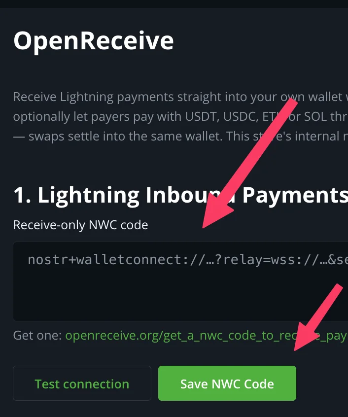
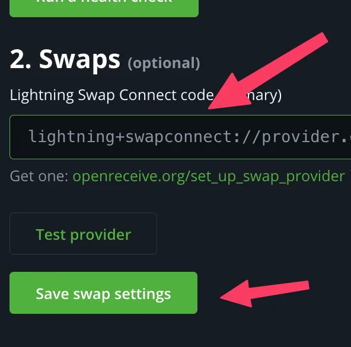
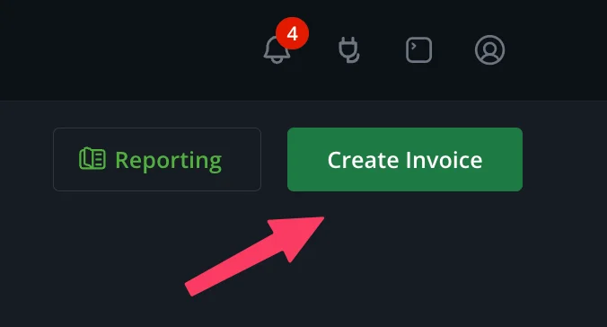

# OpenReceive for BTCPay Server

Receive Lightning payments straight into a wallet you control, with a
receive-only NWC code. Optionally let payers pay with USDT, USDC, ETH or SOL
through a Lightning Swap Connect provider; swaps settle into the same wallet.
Requires BTCPay Server 2.4.2 or later.

## Setup

**1. Open OpenReceive** in the store's sidebar, under Wallets.

**2. Paste your receive-only NWC code** and click **Save NWC Code**.
**Test connection** first if you want to see what the wallet supports.
Get a code at https://openreceive.org/get_a_nwc_code_to_receive_payments.

**3. Optional: turn on swaps.** Paste a Lightning Swap Connect code and click
**Save swap settings**. Get one at https://openreceive.org/set_up_swap_provider.

**4. Done.** The page shows **Wallet connected** and, if you set up a
provider, **Swaps on**. Your wallet is now the store's Lightning node.

## Try it

**5. Open Invoices** in the sidebar.

**6. Click Create Invoice.**

**7. Enter an amount** and click **Create**.

**8. The checkout** offers Lightning, plus one option per asset your swap
provider supports. Lightning payments land in your wallet; swaps settle into
it through the provider.

## Good to know

- **Receive-only.** The plugin refuses an NWC code that can spend, and never
  calls a send method whatever the wallet grants. Lightning payouts and
  Lightning refunds are unavailable with this backend by design.
- **Your wallet is the store's Lightning node.** BTCPay mints every invoice
  in it and records payments with its own settlement machinery. The internal
  node is never used.
- **Run a health check** on the OpenReceive page checks the connection,
  notifications, the provider and the invoice expiration, with a fix link on
  every failing probe.

Installing the plugin: https://openreceive.org/guides/quickstart-btcpay.
Every setting, Greenfield route, swap state and health probe:
https://openreceive.org/guides/btcpay-reference. MIT licensed; source at
https://github.com/OpenReceive/openreceive (`packages/dotnet`).
