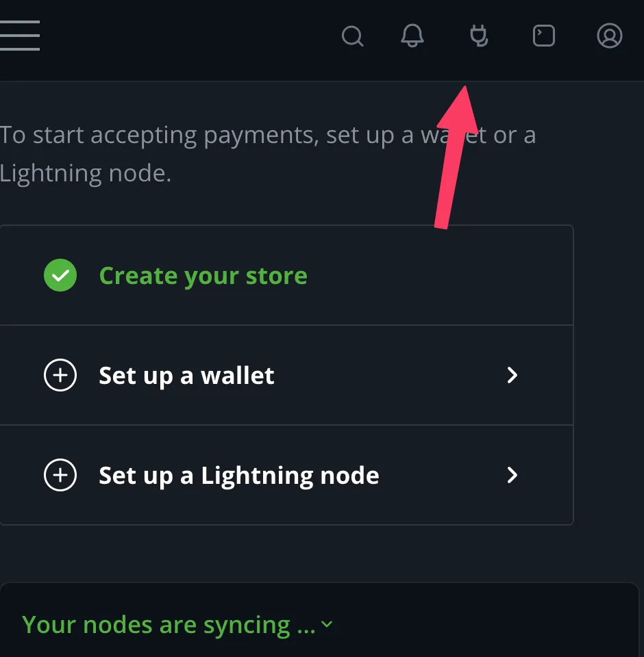
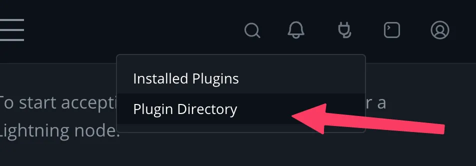
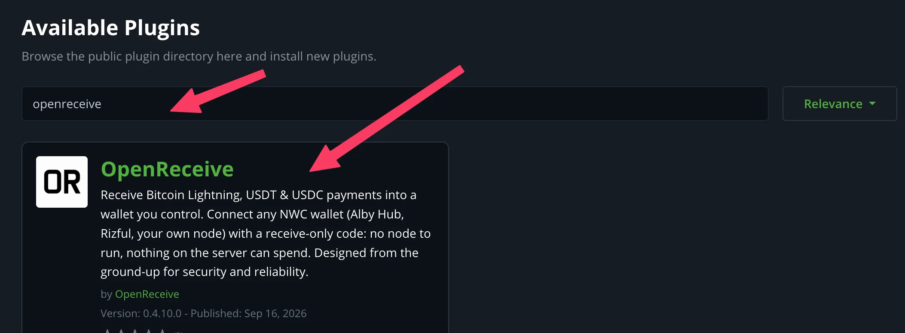
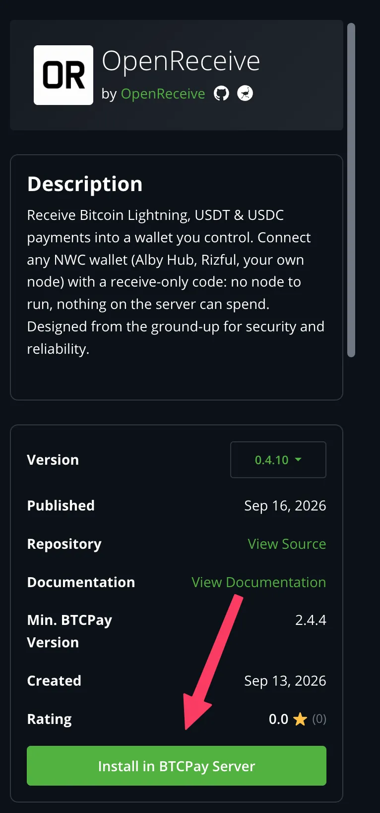
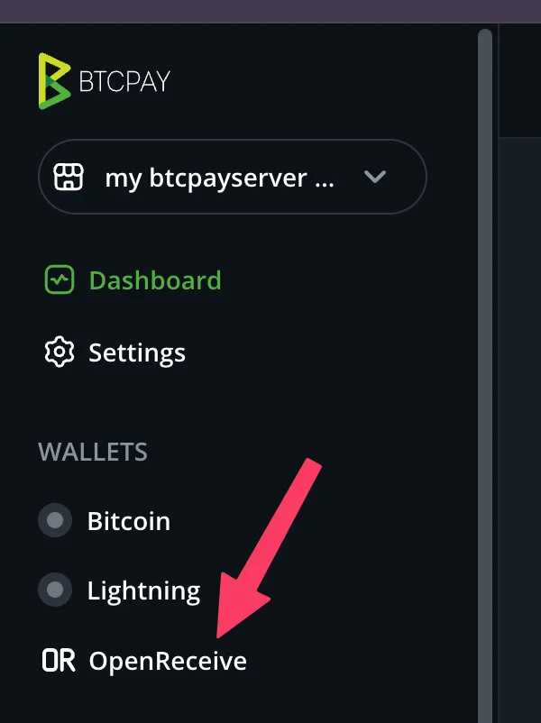
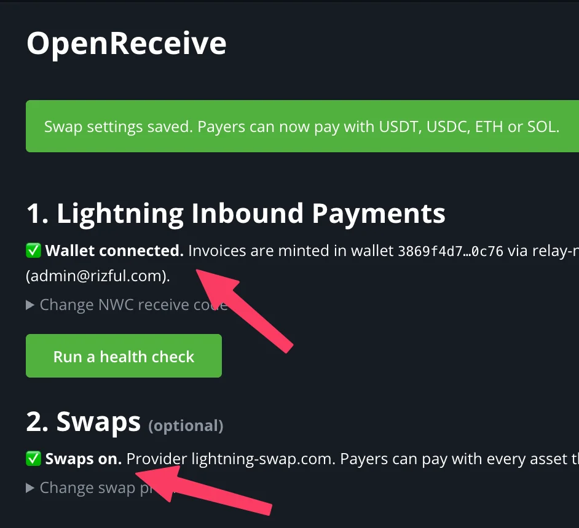
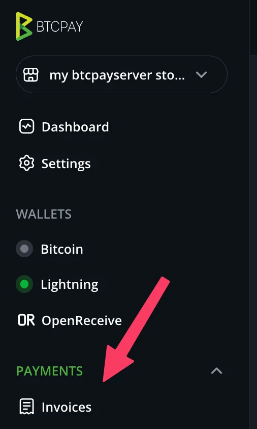
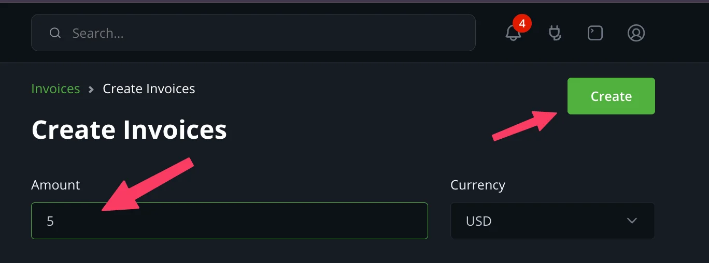
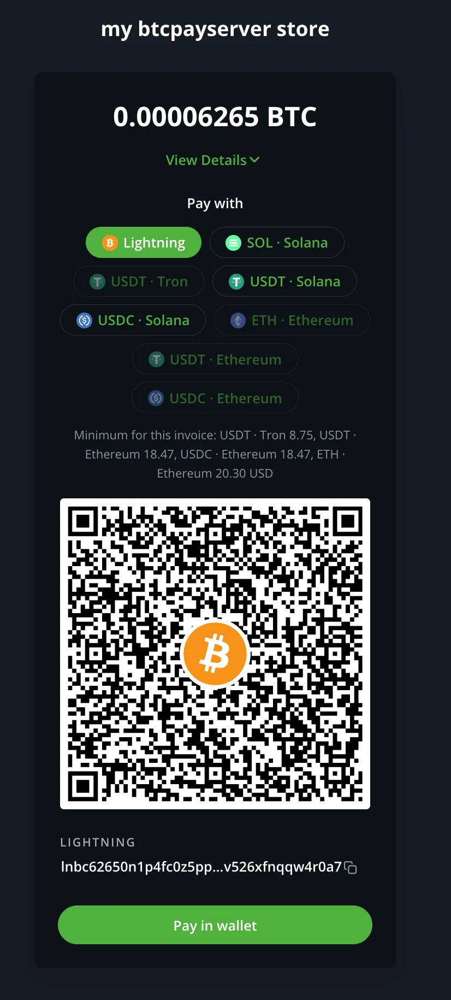

# OpenReceive for BTCPay Server

Receive Lightning payments straight into a wallet you control, with a
receive-only NWC code. Optionally let payers pay with USDT, USDC, ETH or SOL
through a Lightning Swap Connect provider, which converts these payments to
BTC over Lightning in your connected wallet. Asset and network availability
depends on the provider.
Requires BTCPay Server 2.4.4 or later.

The whole setup in 30 seconds:

https://github.com/user-attachments/assets/9aee9edb-e62c-4935-b885-a2e2c4380834

<!-- That is GitHub's upload of docs/assets/btcpayserver/basic-btcpayserver-demo-compressed.mp4;
     a bare attachment URL is the only form GitHub renders as a video player.
     openreceive.org plays the repo copy instead (site-contract.json, /btcpay → video). -->

## Install the plugin

Sign in to your BTCPay Server as a **server administrator**. If someone else
hosts your server, ask them to install the plugin for you.

**1. Open the Plugins menu** — the plug icon in the top-right corner.

**2. Click Plugin Directory.**

**3. Search for `openreceive`** and click the **OpenReceive** result.

**4. Click Install in BTCPay Server.** Confirm when prompted, then click
**Restart now** and wait for BTCPay to come back. Select your store and follow
the setup below.

For the full quickstart, see https://openreceive.org/guides/quickstart-btcpay.

## Setup

**5. Open OpenReceive** in the store's sidebar, under Wallets.

**6. Paste your receive-only NWC code** and click **Save NWC Code**.
**Test connection** first if you want to see what the wallet supports.
Get a code at https://openreceive.org/get_a_nwc_code_to_receive_payments.

**7. Optional: turn on swaps.** Paste a Lightning Swap Connect code and click
**Save swap settings**. Get one at https://openreceive.org/set_up_swap_provider.

**8. Done.** The page shows **Wallet connected** and, if you set up a
provider, **Swaps on**. Your wallet is now the store's Lightning node.

## Try it

**9. Open Invoices** in the sidebar.

**10. Click Create Invoice.**

**11. Enter an amount** and click **Create**.

**12. The checkout** offers Lightning, plus one option per asset your swap
provider supports. Lightning payments land in your wallet; swaps settle into
it through the provider.

## Good to know

- **Receive-only.** The plugin refuses an NWC code that can spend, and never
  calls a send method whatever the wallet grants. Lightning payouts and
  Lightning refunds are unavailable with this backend by design.
- **Your wallet is the store's Lightning node.** BTCPay mints every invoice
  in it and records payments with its own settlement machinery. The internal
  node is never used.
- **Run a health check** on the OpenReceive page checks the connection,
  notifications, the provider and the invoice expiration, with a fix link on
  every failing probe.

Installing the plugin: https://openreceive.org/guides/quickstart-btcpay.
Every setting, Greenfield route, swap state and health probe:
https://openreceive.org/guides/btcpay-reference. MIT licensed; source at
https://github.com/OpenReceive/openreceive (`packages/dotnet`).

Payment recovery changes require a coordinated host/worker upgrade. See the [payment safety upgrade and historical recovery procedure](https://github.com/openreceive/openreceive/blob/main/packages/dotnet/BTCPayServer.Plugins.OpenReceive/PAYMENT-SAFETY-UPGRADE.md) for additive migrations, selected legacy-account repair, retired swap refunds, and the provider budget scope.
