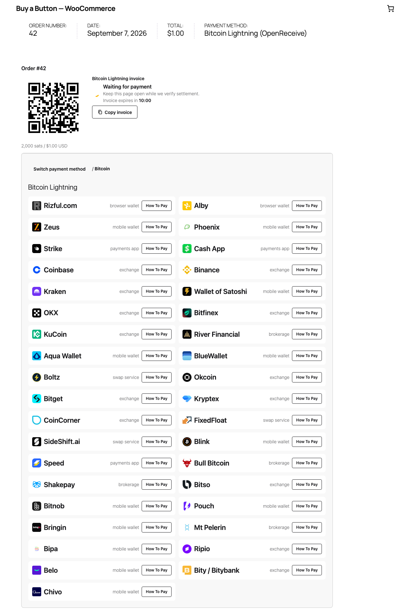

# OpenReceive for WordPress + WooCommerce

Receive Bitcoin Lightning payments directly into your wallet. WooCommerce owns
orders, prices, stock and email; the bundled PHP engine owns payment attempts
in the existing WordPress database. Both classic and block checkout use the
same OpenReceive checkout on the order-pay page. HPOS is supported.

OpenReceive supports optional swaps from **USDT, USDC, SOL, and ETH** through
a configured swap provider. The provider converts the payment to **BTC over
Lightning**, which settles into the merchant's connected wallet. Available
assets and networks depend on the provider; swaps are optional.

## Install

Requires WordPress 6.6+, WooCommerce 9+, PHP 8.2+ (64-bit), GMP, sodium and
MySQL 8 or MariaDB 10.5+. SQLite WordPress is not supported.

Install a built `openreceive-wordpress-<version>.zip` through **Plugins → Add
New → Upload Plugin**, then configure **WooCommerce → Settings → Payments →
OpenReceive**. The source directory is not an installable plugin archive.

The [WooCommerce quickstart](https://github.com/OpenReceive/openreceive/blob/master/docs/guides/quickstart-woocommerce.md)
covers credentials, guest recovery, scheduled reconciliation and refunds.
The [Docker demo](https://github.com/OpenReceive/openreceive/blob/master/examples/wordpress/README.md) runs a real WordPress
shop and WooCommerce checkout using the shared demo product catalog.



## Build from source

Build locally (PHP, Composer, Node and WP-CLI are required):

```sh
npm ci
npm run build:packages
composer install --working-dir=packages/php/wordpress
npm run release:wordpress:build
```

If WP-CLI is a local phar, set `OPENRECEIVE_WP_CLI=/absolute/path/wp-cli.phar`.

The archive includes namespace-isolated PHP dependencies and the complete
standalone checkout assets; it loads no browser CDN dependencies.

## Operate your store

Run `wp openreceive doctor` for configuration and schema checks, and
`wp openreceive reconcile` for a gated reconciliation pass. The optional
`wp openreceive notifications` command runs as a separate process. Action
Scheduler provides the default background safety net. A real cron runner is
needed if the store receives no visits; the web process starts no timer.

`onPaid` commits settlement metadata inside the same database transaction as
the payment attempt. `afterPaid` calls WooCommerce `payment_complete` after
commit. A durable order marker allows checkout requests and scheduled passes
to repair interrupted completion; a database lock serializes completion per
order. WooCommerce handles stock, emails and its payment note. Cancelled or
refunded orders require merchant review and are never reopened automatically.

Merchant refunds are manual because the wallet is receive-only. Payer swap
refunds remain available through the authorized order-pay link. Deactivation
retains attempts. Uninstall removes them only when explicitly configured.
